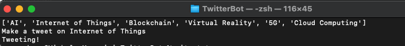

# Twitter Bot

## Introduction

Twitter bot - Schedules a new tweet for you every 3 hours or so depending on the cron schedule you put the main.py file on.

File Structure

1. gpt_service.py - To interact with OpenAI API of chat GPT.

2. twitter_service.py - 
    - To interact with twitter API. Twitter requires one time manual authentication so create a flask app with a basic root endpoint ("/") which would authenticate the application and save the authentication token in redis cache database.
    - This authentication token has validity of only 2 hours but it is used to create a refresh token with validity of 6 months so that it does not require user involvement after the first tweet.

3. main.py - The file that should be added cron schedule on. This script will stitch ever component together. Will get the tweet content from chatGPT module and also will take care of refreshing the authentication token. Everytime this script runs it will create a new tweet as user.

